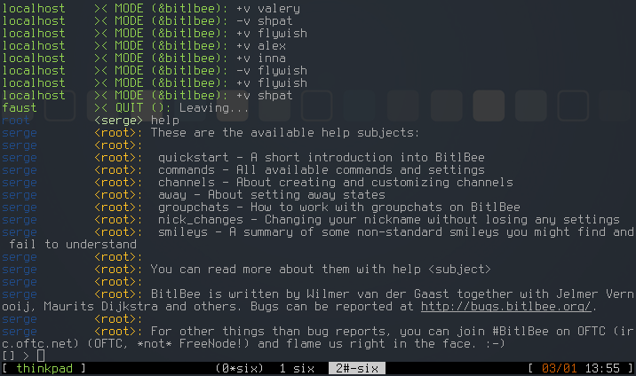

title: six - simple IRC client kept simple
keywords: irc, simple, client, terminal

-----

six
===

six - simple IRC client kept simple (that's what the name means: sicks ->
six). six is really tiny piece of software - only 200 SLOC.

It's mainly inspired by [sic](http://tools.suckless.org/sic).

install
-------

Get the sources and compile it. The only dependency is Readline.

	hg clone https://bitbucket.org/zserge/six
	cd six
	make

If you want to install it - copy `six` binary to your `/usr/local/bin`
folder. I hope one day I will add a `make install` rule.

usage
-----

In short, you can run it like:

	six <host>

For more automated usage you can specify your nickname, channel name,
password (if you are not paranoid) or a custom startup script:

	six -n john -k pa55w0rd -j "#johnchan" irc.server.net

	six -s <commands> irc.server.net

commands
--------

After your connected to the server and passed authorization step
you can use these commands:

* `:j channel` - join the channel
* `:l channel` - leave the channel
* `:m nick msg` - send message to the user `<nick>`
* `s nick` - set default interlocutor to `<nick>`

Here's a typical session:

	:j #johnchan
	hi all!       <-- everyone on #johnchan reads this
	:m jack hi, jack  <-- only Jack reads this
	:m jane hi, jane <-- only Jane reads this

	:s jane       <-- now you are talking to Jane by default
	i'm using six IRC client and it's the best! <-- Jane reads this
	wnat to try it?                             <-- and this, too

Another piece of sugar is autoreply. When someone send you a message
and you press `<tab>` his nickname is written as a recepient of your next
message:

	<john> hi!
	(here you press Tab)
	> :m john _ <-- here's your cursor
	
See?

bitlbee
-------

I also like using six with bitlbee. I start it like:

	six -s "PRIVMSG root :IDENTIFY myPassw0rd" localhost

And then I easily use my jabber in the terminal.

screenshots
-----------

If your terminal looks nice - `six` also looks nice ;)

Here's my six+urxvt+tmux

